# aimd

> [!WARNING]
> **Work in progress — not ready for use.** This project is under active development. APIs, commands, and file formats will change without notice.

Track, sync, and restore your AI .md files across machines without committing them to your project repository.

## What it does

AI coding tools like Claude, Cursor, and GitHub Copilot read project-specific context files (`CLAUDE.md`, `.cursor/rules.md`, etc.) to understand your codebase. These files are valuable — but they often contain knowledge you can't or don't want to commit to a shared repository: client-specific notes, personal workflow preferences, or proprietary architectural context.

**aimd** lets you track those files in a private Git store and sync them across machines — without ever committing them to the project repository.

```
# Track a file — moves it to your private store, symlinks it back
aimd track CLAUDE.md

# On another machine — restore the symlink after a fresh clone
aimd restore

# Keep the store in sync
aimd sync
```

The tracked file stays available in your project directory (via symlink), is hidden from `git status` (via `.git/info/exclude`), and is versioned and synced through your own private Git remote.

## How it works

1. `aimd track <file>` copies the file to a private Git store (`~/.aimd/store/`), creates a symlink in its place, and adds it to `.git/info/exclude` so it never appears in `git status`.
2. `aimd sync` commits changes and pushes to your private remote — or pulls and rebases if the remote has newer changes.
3. `aimd restore` recreates the symlink on any machine after a fresh clone.

No server. No daemon. No cloud dependency beyond a standard Git remote (GitHub, GitLab, Gitea, or self-hosted).

<p align="center">
  
</p>

## Status

The core file tracking and sync engine is under development.

| Command | Status |
|---|---|
| `aimd init` | 🚧 not yet implemented |
| `aimd track` | 🚧 not yet implemented |
| `aimd untrack` | 🚧 not yet implemented |
| `aimd sync` | 🚧 not yet implemented |
| `aimd restore` | 🚧 not yet implemented |
| `aimd status` | 🚧 not yet implemented |
| `aimd watch` | 🚧 not yet implemented |
| `aimd resolve` | 🚧 not yet implemented |
| `aimd doctor` | 🚧 not yet implemented |

## Install

Not available yet. Install from source once a release is tagged:

```bash
go install github.com/CyberSecAuto-Labs/aimd@latest
```

## License

[Apache 2.0](LICENSE)
